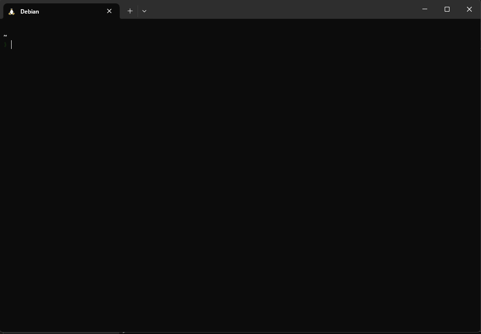

# 🚀 Cross-Platform Dotfiles

[](LICENSE.md)

**Documentation ( [English](README.md), [Japanese](README_JA.md) )**

A powerful dotfiles management system designed for developers who work across multiple platforms. Seamlessly manages your development environment across Debian-based Linux (including WSL2), and macOS.

<p align="center">
  
</p>

## ✨ Key Features

### 🔄 Cross-Platform Compatibility
- **WSL2**: Full support for Windows Subsystem for Linux
- **Debian-based Linux**: Native support for Debian and Ubuntu
- **macOS**: Complete support for both Apple Silicon and Intel processors

### 🛡 Safe Configuration Management
- **Automatic Backups**: Every existing configuration is backed up before modification
- **Easy Rollback**: Restore your previous configuration with a single command:
  ```bash
  make restore
  ```

### 🎯 Smart Package Management
- **Sheldon Integration**: Modern plugin management using `plugins.toml`
  - Centralized plugin configuration
  - Fast, async plugin loading
  - Easy to maintain and update
- **Platform-Specific Package Management**:
  - Homebrew for macOS and Linux
  - apt for Debian-based systems

### ⚡️ Enhanced Productivity Tools
- **FZF Integration**:
  - Quick file search (`Ctrl+T`)
  - Command history search (`Ctrl+R`)
- **Custom FZF Commands**:
  - `fb`: Interactive Git branch switching
  - `sf`: Search file contents with preview
  - `fd`: Fast directory navigation based on file selection

### 🎨 Terminal Customization
- **Nerd Fonts Support**: Automatic installation and configuration
  - Windows (via Scoop)
  - macOS (via Homebrew)
- **Terminal-Specific Setup**:
  - Windows Terminal
  - iTerm2
  - Terminal.app

## 🚀 Quick Start

1. **Clone the Repository**:
   ```bash
   git clone https://github.com/yourusername/dotfiles.git
   cd dotfiles
   ```

2. **Install**:
   ```bash
   make install
   ```

## 📦 What's Included

### Core Tools
- **Shell**: Modern ZSH configuration with Sheldon plugin management
- **Git**: Optimized Git configuration with useful aliases
- **Terminal**: Platform-specific terminal configurations
- **Fonts**: JetBrainsMono Nerd Font for a consistent look

## 🔄 Backup and Restore

### Automatic Backups
- All existing configurations are automatically backed up before installation
- Backups are stored in `~/{fileName}.backup`

### Restore Previous Configuration
```bash
make restore
```

## 📝 License

MIT © [hashiiiii](LICENSE.md)

---
💡 **Tip**: Run `make help` to see all available commands and their descriptions.

*This README was generated with the assistance of AI (Codeium).*
