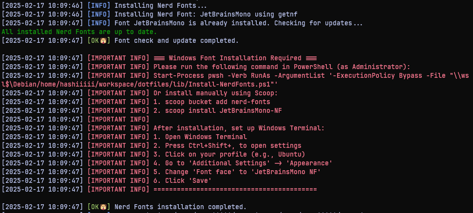

# 🚀 Cross-Platform Dotfiles

[](LICENSE.md)

**ドキュメント ( [English](README.md), [Japanese](README_JA.md) )**

複数のプラットフォームで作業する開発者向けに設計された強力な dotfiles 管理システムです。Debian ベースの Linux（WSL2 を含む）と macOS の開発環境をシームレスに管理します。

<p align="center">
  
</p>

## 📚 Overview

<!-- START doctoc generated TOC please keep comment here to allow auto update -->
<!-- DON'T EDIT THIS SECTION, INSTEAD RE-RUN doctoc TO UPDATE -->
<!-- param::title::Details:: -->
<details>
<summary>Details</summary>

- [✨ 主な機能](#-%E4%B8%BB%E3%81%AA%E6%A9%9F%E8%83%BD)
  - [🔄 クロスプラットフォーム対応](#-%E3%82%AF%E3%83%AD%E3%82%B9%E3%83%97%E3%83%A9%E3%83%83%E3%83%88%E3%83%95%E3%82%A9%E3%83%BC%E3%83%A0%E5%AF%BE%E5%BF%9C)
  - [🛡 安全な設定管理](#-%E5%AE%89%E5%85%A8%E3%81%AA%E8%A8%AD%E5%AE%9A%E7%AE%A1%E7%90%86)
  - [🎯 パッケージ管理](#-%E3%83%91%E3%83%83%E3%82%B1%E3%83%BC%E3%82%B8%E7%AE%A1%E7%90%86)
  - [⚡️ fzf ベースのツール類](#%EF%B8%8F-fzf-%E3%83%99%E3%83%BC%E3%82%B9%E3%81%AE%E3%83%84%E3%83%BC%E3%83%AB%E9%A1%9E)
  - [🎨 ターミナルカスタマイズ](#-%E3%82%BF%E3%83%BC%E3%83%9F%E3%83%8A%E3%83%AB%E3%82%AB%E3%82%B9%E3%82%BF%E3%83%9E%E3%82%A4%E3%82%BA)
- [🚀 クイックスタート](#-%E3%82%AF%E3%82%A4%E3%83%83%E3%82%AF%E3%82%B9%E3%82%BF%E3%83%BC%E3%83%88)
- [📦 含まれるもの](#-%E5%90%AB%E3%81%BE%E3%82%8C%E3%82%8B%E3%82%82%E3%81%AE)
  - [コアツール](#%E3%82%B3%E3%82%A2%E3%83%84%E3%83%BC%E3%83%AB)
- [🔄 バックアップと復元](#-%E3%83%90%E3%83%83%E3%82%AF%E3%82%A2%E3%83%83%E3%83%97%E3%81%A8%E5%BE%A9%E5%85%83)
  - [自動バックアップ](#%E8%87%AA%E5%8B%95%E3%83%90%E3%83%83%E3%82%AF%E3%82%A2%E3%83%83%E3%83%97)
  - [以前の設定の復元](#%E4%BB%A5%E5%89%8D%E3%81%AE%E8%A8%AD%E5%AE%9A%E3%81%AE%E5%BE%A9%E5%85%83)
- [🔎 FAQ](#-faq)
- [📝 ライセンス](#-%E3%83%A9%E3%82%A4%E3%82%BB%E3%83%B3%E3%82%B9)

</details>
<!-- END doctoc generated TOC please keep comment here to allow auto update -->

## ✨ 主な機能

### 🔄 クロスプラットフォーム対応
- **WSL2**: Windows Subsystem for Linux の完全サポート
- **Debian ベース Linux**: Debian と Ubuntu のネイティブサポート
- **MacOSX**: Apple Silicon と Intel プロセッサの両方に対応

### 🛡 安全な設定管理
- **自動バックアップ**: 既存の設定は変更前に自動的にバックアップ
- **簡単な復元**: 以下のコマンド一つで以前の設定を復元
  ```bash
  make restore
  ```

### 🎯 パッケージ管理
- **Sheldon 統合**: `plugins.toml` を使用したモダンなプラグイン管理
  - 一元化されたプラグイン設定
  - 高速な非同期プラグインローディング
  - メンテナンスとアップデートが容易
- **プラットフォーム固有のパッケージ管理**:
  - MacOSX と Linux 用の Homebrew
  - Debian ベースシステム用の apt

### ⚡️ fzf ベースのツール類
- **FZF 統合**:
  - クイックファイル検索（`Ctrl+T`）
  - コマンド履歴検索（`Ctrl+R`）
  - ディレクトリナビゲーション（`Alt+C`）
- **カスタム FZF コマンド**:
  - `fb`: インタラクティブな Git ブランチ切り替え
  - `sf`: プレビュー付きファイル内容検索
  - `fd`: ファイル選択によるクイックディレクトリ移動

### 🎨 ターミナルカスタマイズ
- **Nerd Fonts サポート**: 自動インストールと設定
  - Windows（Scoop 経由）
  - MacOSX（Homebrew 経由）
- **ターミナル固有の設定**:
  - Windows Terminal
  - iTerm2
  - Terminal.app

## 🚀 クイックスタート

1. **リポジトリのクローン**:
   ```bash
   git clone https://github.com/yourusername/dotfiles.git
   cd dotfiles
   ```

2. **インストール**:
   ```bash
   make install
   ```

3. **shell の再起動**
   ```bash
   exec zsh
   ```

## 📦 含まれるもの

### コアツール
- **シェル**: Sheldon プラグイン管理を使用したモダンな ZSH 設定
- **Git**: 便利なエイリアスを含む最適化された Git 設定
- **ターミナル**: プラットフォーム固有のターミナル設定
- **フォント**: 一貫した見た目のための JetBrainsMono Nerd Font

## 🔄 バックアップと復元

### 自動バックアップ
- インストール前に既存の設定は自動的にバックアップ
- バックアップは `~/{fileName}.backup` に保存

### 以前の設定の復元
```bash
make restore
```

## 🔎 FAQ
1. **Windows Terminal に Nerd Fonts をインストールしたい**

   <p align="left">
     
   </p>

   このように WSL2 ユーザー向けにはログが表示されるようになっています。出力される path を Windows Terminal から実行することで Nerd Fonts をインストールすることが出来ます。

2. **zsh-plugin を追加したい**

   plugin-manager には sheldon を利用しています。`.config/sheldon/plugins.toml` を編集してください。ドキュメントは[こちら](https://sheldon.cli.rs/Introduction.html)。

3. **自作の便利な関数を追加したい**

   お好みですが、`.zsh/plugins` 配下に `foo.zsh` のように plugin という形で .zshrc から逃がすことをおすすめします。

## 📝 ライセンス
本ソフトウェアはMITライセンスで公開しています。

* [LICENSE.md](LICENSE.md)

また、本ドキュメントの目次は以下のソフトウェアを使用して作成されています。

* [toc-generator](https://github.com/technote-space/toc-generator)

toc-generatorのライセンスの詳細は [Third Party Notices.md](Thirs%20Party%20Notices.md) を参照してください。

---
💡 **ヒント**: 利用可能なコマンドとその説明を見るには `make help` を実行してください。
